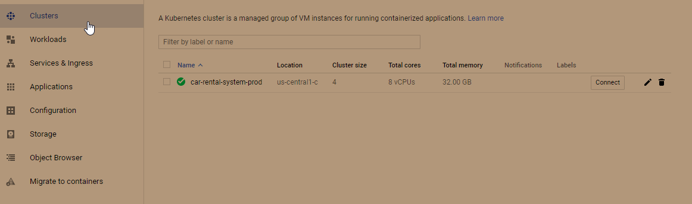
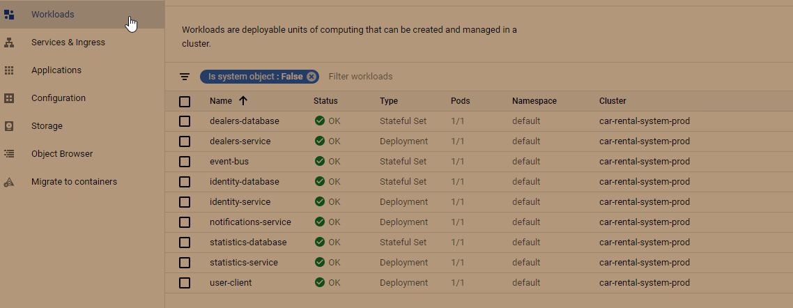
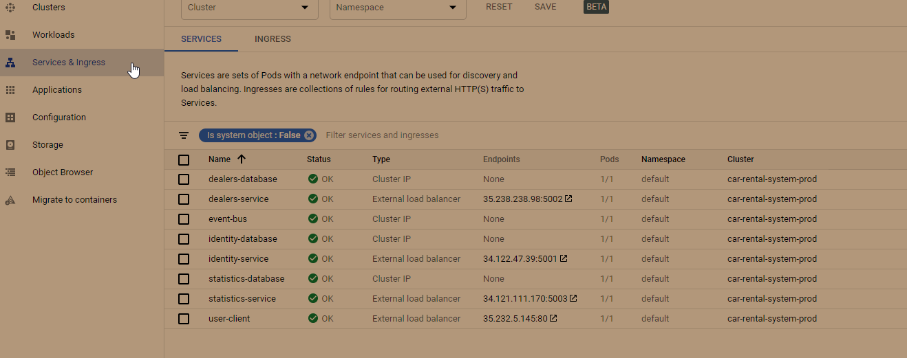
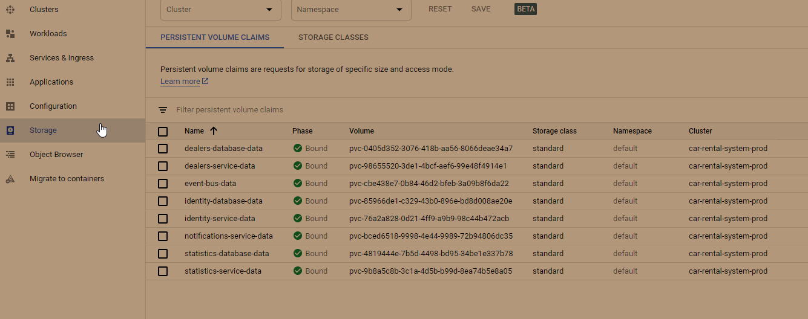

# Process Automation with ASP.NET Core Microservices

## Forked from: https://github.com/ivaylokenov/Process-Automation-with-ASP.NET-Core-Microservices

### Admin and Watchdog clients are removed because GCP (free tier) has ip addresses limit up to 4

#### Client url - http://35.232.5.145

### GCP - Kubernetes Engine
#### Clusters

#### Workloads

#### Services & Ingress

#### Storage
